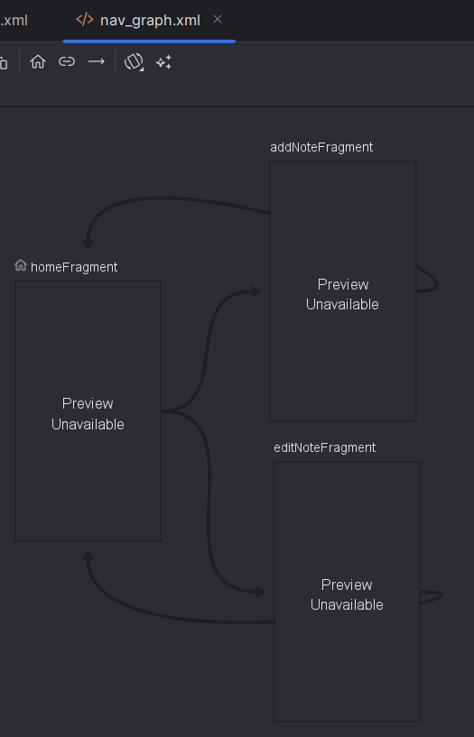
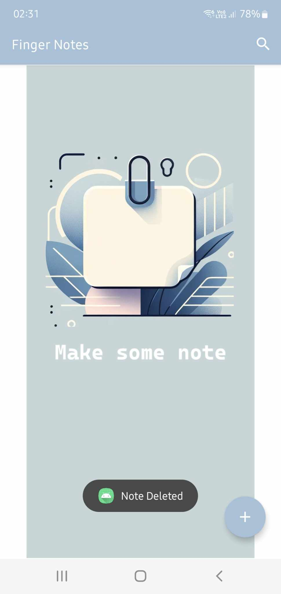
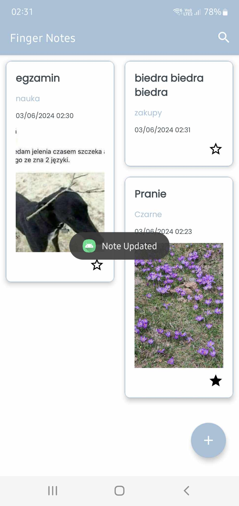
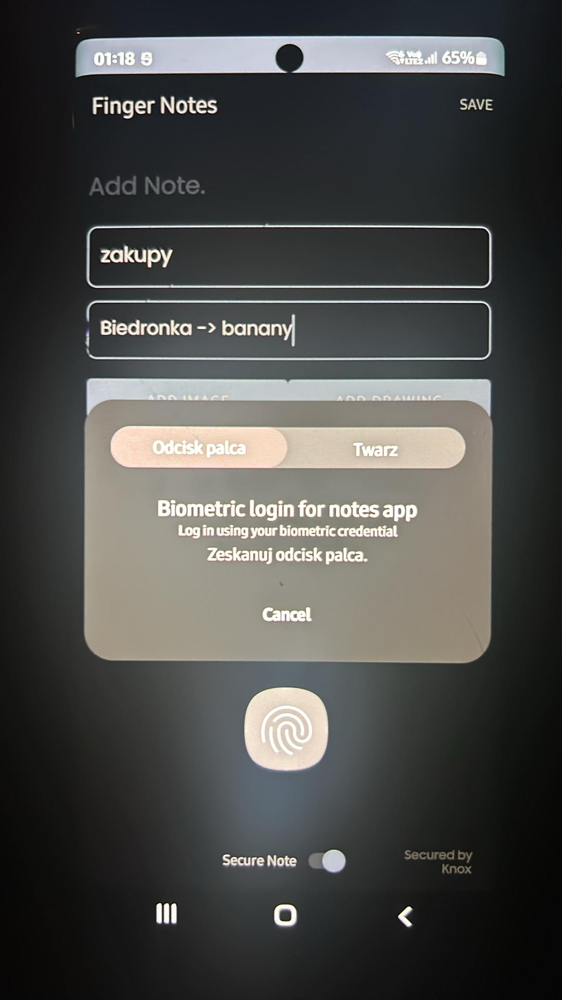
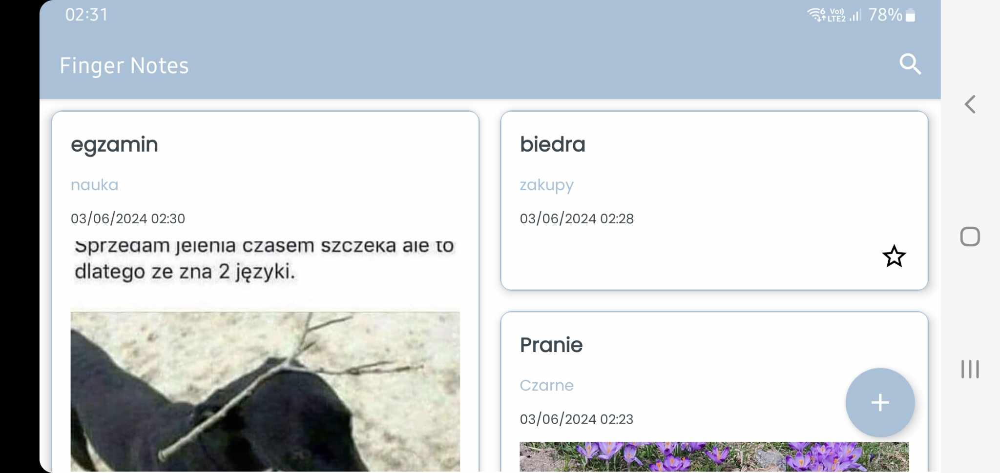

# The Notes App

**The Notes App** is a feature-rich Android application written in Kotlin. It allows users to create, edit, and manage notes securely and efficiently. The app is built using modern Android technologies and adheres to best practices in mobile development.

---

## 🛠️ Technologies and Tools
- **Language:** Kotlin
- **Architecture:** MVVM (Model-View-ViewModel)
- **Database:** Room Database with migrations
- **UI:** Material Design

---

## 📱 App Features
- **CRUD Operations:** Create, read, update, and delete notes.
- **Secure Notes:** Protect notes using fingerprint authentication.
- **Favorites:** Mark important notes as favorites for easy access.
- **Image Support:**
  - Add images from the gallery or capture directly using the camera.
  - View multiple images attached to a single note.
- **Room Database:** Efficient and secure local data storage with schema migrations.
- **Fragments:**
- **Dark Mode:** Full support for light and dark themes.
- **Screen Rotation:** The app automatically adapts to portrait and landscape modes.
- **Biometric Authentication:** Ensures that only authorized users can access secured notes.
- **Animations:** Smooth transitions and RecyclerView animations.

---

## 📂 Project Structure
The project is organized based on the **MVVM** pattern:
- `data/` – Contains database entities, DAO, and repository.
- `ui/` – Includes fragments, adapters, and layout files.
- `viewmodel/` – Manages app state and business logic.
- `utils/` – Utility classes, such as biometric authentication.

---

## 🔍 Preview
Here are some screenshots of the app in action:

### Navigation Graph


### Home Screen, Notes List and Biometric Authentication
<div style="display: flex; gap: 10px; justify-content: center;">
  
  
  
</div>

### Horizontal Layout


---

## 💻 System Requirements
- **Android Studio:** Arctic Fox or newer.
- **JDK:** 11 or later.
- **Recommended Android Version:** 12.0 (API 31).

---

## ⚙️ Installation
1. **Clone the repository:**
   ```bash
   git clone https://github.com/USERNAME/TheNotesApp.git

2. **Open the project in Android Studio:**
   ```bash
    Launch Android Studio.
    From the welcome screen, select "Open" or go to File > Open....
    Navigate to the folder where the repository was cloned and select the project directory.


